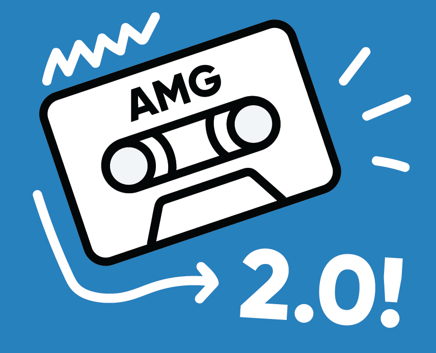

<!doctype html>

<html lang="en">
<head>
  <meta charset="utf-8">

  <title>The HTML5 Herald</title>
  <meta name="description" content="The HTML5 Herald">
  <meta name="author" content="SitePoint">

  <link rel="stylesheet" type="text/css" href="css/prc.css">

</head>

<body>
	

		Due to COVID-19 concert cancellations, we are using this downtime to bring you something really exciting!
	

	

		

			
		

		

			<h1>
				Hey Asheville,
				 
				We'll be back soon!
			</h1>
			<b>
				(Bigger and better than ever)
			</b>
		

	

	

		

			
		

		

			<h1>
				Hey Asheville,
				 
				We'll be back soon!
			</h1>
			<b>
				(Bigger and better than ever)
			</b>
		

	
	
</body>
</html>